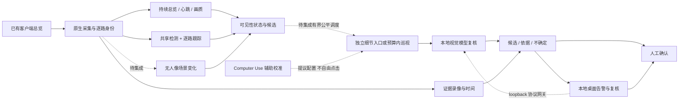

# Factory Monitor Blueprint · 工厂监控架构与执行手册

面向中国大陆本地运行的监控工程交接仓库：把既有摄像头客户端画面转成**可定位、可回放、需要人工确认的事件候选**。这里集中保存架构、固定源码、可运行实验、安装校准步骤、测试证据和故障恢复流程。

**现场方向已确认：优先 Seetong，以电脑屏幕/窗口画面为主输入，不要求客户端提供 SDK 或视频接口。** 这套输入方式可扩展到其他监控软件；界面切换按实际画面校准，版本与现场效果仍待核验。

**当前版本：`0.2.0-preview`，工程预览。真实现场验收尚未通过。** 自动客户端点击未启用；16 路仅属于主动巡视实验，现有应用最多配置 10 路。RTX 4060 / 约一万元整机是待实测设计基线，不是性能或采购承诺。桌面控制中心提供本地告警、模型协议网关和只读设备建议；这些功能不证明真实 Windows 或 4060 性能。

## 先选你的任务

|我要做什么|从这里开始|结果是什么|
|---|---|---|
|先了解整体方案|[架构与决策](docs/01-architecture.md)|理解画面、算力、盲区和模型的边界|
|几分钟跑通不读屏幕的实验|[快速开始](docs/00-quickstart.md)|合成 JSON 与中文结果，现场仍为 NOT_TESTED|
|在另一台 Windows 准备执行|[Windows 全流程](docs/02-windows-execution.md)|独立环境、候选安装、诊断与现场准备|
|在 Mac 准备或验证|[macOS 全流程](docs/03-macos-execution.md)|本机环境、ScreenCaptureKit 前置条件与实验|
|按具体软件学习和调教|[软件适配与学习流程](docs/10-client-learning.md)|按软件版本建档，示教、回放、独立验证与回滚|
|接入实际监控客户端|[标定与 Computer Use 学习](docs/04-client-calibration.md)|逐路映射、画质与心跳证据；不自动解禁点击|
|判断能否交付|[验证与验收](docs/05-validation-and-acceptance.md)|从单路到十路、准确率、15–30 分钟演示与 72 小时验收|
|遇到断流、卡住、磁盘满或升级失败|[运维与回退](docs/06-operations-and-recovery.md)|保留证据、隔离故障、恢复原版本|
|继续开发或选择硬件路线|[研发顺序与容量](docs/07-roadmap-and-capacity.md)|有依据的接入顺序与加速采用门槛|
|核查来源、版本与研究结论|[来源与证据](docs/08-sources-and-evidence.md)|源码指纹、测试口径、官方研究链接|
|下载交接包、准备大陆离线执行|[发布包与离线资源](docs/09-delivery-and-offline.md)|取得源码、全量模型/依赖分片及校验工具|
|升级桌面程序、选择模型和设备路线|[升级与设备策略](docs/11-upgrade-and-device-strategy.md)|了解本地应用、模型接口、设备档位和升级边界|
|运行桌面演示或准备现场试跑|[演示与现场试跑](docs/12-demonstration-and-field-run.md)|启动器、演示步骤、录屏要求与现场验收边界|
|用真实单路/九宫格录屏进行本机验证|[真实录像与读屏验证](docs/14-real-recording-validation.md)|按源时间抽样、逐路读钟、实际人物检测与本地结果查看|
|了解 8GB 基线、捕获隔离和设备升级门禁|[8GB 与采集隔离](docs/13-8gb-and-capture-isolation.md)|保守资源默认、采集权限边界和 8GB 以上逐项验收|

## 架构概览

总览优先持续保留。放大只有在取得更多**源像素**时才增加可辨细节；单屏轮流放大会失去其他路的总览。纯像素变化不等于物料分类，检测不到人不等于确认离岗，模型输出不等于偷窃结论。

## 仓库里实际有什么

- `implementation/`：原项目提交 `260862912d7386642aa538ac49d72442b9d673bb` 的 129 个跟踪文件原样快照，含运行时、四个新实验模块、测试及历史文档。不是从旧 main 下载的替代修复版。
- `docs/`：本仓库当前执行手册。历史材料中的完成状态、硬件报价和路径须按原日期理解，以这里的步骤及当前证据为准。
- `evidence/`：逐文件源码哈希、原版本合成实验与双平台 CI 原始日志。本仓库的新 CI 是另外一条验证记录。
- `templates/`：待填写的现场记录模板，不是假造的通过证明，也不是应用自动读取的新配置。
- `scripts/verify_repository.py`：检查固定源码、文档本地链接和必备交付文件。
- `scripts/build_release.py`：从干净已提交版本生成可校验的架构/源码 ZIP。
- `scripts/bundle_parts.py` 与 `scripts/Restore-OfflineBundle.ps1`：分片验证与无损还原；PowerShell 入口不要求预装 Python。
- `scripts/verify_offline_zip.py`：检查完整资源 ZIP 的固定哈希、每个 payload 和 Qwen 内容引用。
- `desktop/` 与 `scripts/start-desktop.*`：本地桌面控制中心源码和启动器；当前交付是源码，不是已签名的 EXE 或安装器。首次启动需准备 Python 3.12 环境并安装桌面依赖，详见[演示与现场试跑](docs/12-demonstration-and-field-run.md)。

桌面 CLI 默认使用保守的 `vram8gb` 资源档位；启用模型复核时必须使用固定的单模型 [8GB 路由模板](templates/8gb-model-routes.example.json)并完成预热门禁。通用 Ollama/OpenAI 双协议路由，以及 Mac 上的本机模型对照，须显式传 `--resource-profile existing` / `-ResourceProfile existing`；这条实验路径没有 8GB 保障。8GB 是起步基线而非上限，更大显存不会自动加负载；Apple Silicon、12–16 GB、24 GB 或第二主机均需按相同采集、告警、资源、准确率和长稳 Gate 逐项验收后，才调整输入清晰度、频率或模型。硬件建议、8GB 权重加载和十路合成测试都不是现场性能承诺，完整边界见[设备升级策略](docs/11-upgrade-and-device-strategy.md)。

**源码与大资源分开发布。** 当前源码版本为 `v0.2.0-preview`；完整 Windows 资源仍使用 [v0.1.0-preview Release](https://github.com/wailliamkf-commits/factory-monitor-blueprint/releases/tag/v0.1.0-preview) 的 7 个分片，包含 Qwen3-VL 2B Q4_K_M、YOLO11n、Python/VC/Ollama 安装器和 55 份依赖资源。资源恢复后与原 6,637,814,564 字节 ZIP 完全一致；更新桌面源码时无需重复上传这组资源。模型与来源清单见[资源索引](resources/README.md)，下载与还原见[交付说明](docs/09-delivery-and-offline.md)。

大文件放在 Release 附件，Git 历史及 Blueprint ZIP 保留源码和清单。资源包中的旧候选源码 `1f6f242` 与 `implementation/` 的架构快照 `2608629` 分开登记，不自动覆盖现场修复版。包内没有 NVIDIA 显示驱动、监控客户端安装器、账号、生产画面、现场标定或 macOS 专用安装器。两套模型是固定的通用基线，尚未针对现场软件或行为完成训练。

## 当前证据与未完成项

固定源版本已取得开发 Mac 275 项通过；原云端 Windows 272 项通过/3 项跳过，Mac 274 项通过/1 项跳过，十路合成负载与主动观察实验通过。详见[原始证据索引](evidence/source-2608629/README.md)。新增桌面模块的测试覆盖模型接口、告警、设备建议和界面；最新桌面证据见[本轮验证记录](evidence/desktop-v0.2/README.md)。模型协议适配没有消除历史 Qwen 负例误报与十候选 15 秒容量缺口。这不等于现场安装、真实 Windows 运行、真实十路、4060 并发推理、网络可达性或行为准确率通过；这些仍为 `NOT_TESTED`。

新实验覆盖无人物品矩形变化、安静镜头巡视、错镜头/旧帧/超时故障以及像素/盲时预算；它们尚未接入运行时控制链路。现场接入须保留已有 Windows 录像/停止修复，不覆盖原项目，不凭“测试全绿”跳过[验收步骤](docs/05-validation-and-acceptance.md)。

本仓库当前为公开仓库，仅包含源码、合成或脱敏证据；生产画面、现场账号、未脱敏日志和标定资料留在本地受控目录。第三方依赖和模型的许可需按实际商业交付另行核对；引用公开研究不等于已复制其未公开实现或取得其商用授权。
