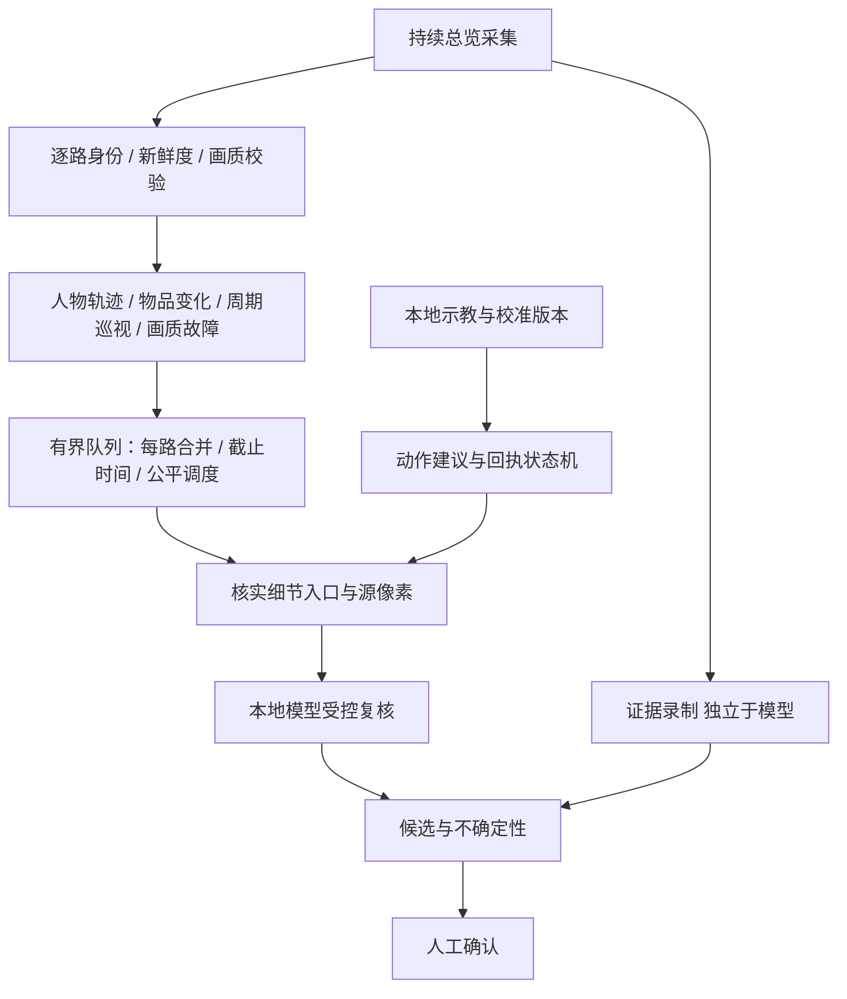

# 架构：稳定性、画面信息与执行边界

## 1. 目标与约束

目标是从十路已有监控画面中发现可见物料变化、区域活动与工位占用候选，保留对应证据，缩短人工查找时间。中国大陆运行、默认本地分析、Mac/Windows 接入、4060 级设备与约万元预算是设计约束。准确率、时效与持续可用性必须分别验证，不能以其中一项替代其他项。

系统不推断人格、动机或员工品德；“疑似异常”需要人结合现场制度、任务、遮挡与上下文确认。自动处分不属于本项目链路。

## 2. 三种输入路线

|路线|适用条件|优势|限制与放行条件|
|---|---|---|---|
|A：现有客户端屏幕|只有客户端可见画面，无法取得源流|无需更换摄像头；已有 Windows WGC / Mac ScreenCaptureKit 适配|客户端布局、像素、遮挡和每路心跳必须验证|
|B：常驻总览＋独立细节窗口|客户端确实支持独立且持续渲染的第二窗口/屏幕|看细节时保留其余路总览|不得假设最小化或被遮挡仍有新帧；确认镜头身份与源分辨率|
|C：经授权 RTSP/SDK 源流|现场确有合法可用凭据、接口和网络能力|可独立获取检测子流、高清帧和原录像|当前未实现接入；需验证连接数、解码、丢包重连与资源竞争|

A 是现有入口。2026-09-26 用户提出可向厂家申请接口后，C 成为厂家可配合时的优先建设路线；未取得源流时继续验证 B。C 尚未实现，不改变当前屏幕程序的启动前提。九路持续观测、人员活动调度与厂家资料见[最新专项决策](15-nine-stream-behavior-architecture.md)。没有独立细节入口时，单屏串行巡视必须报告实际未覆盖时间。

## 3. 为什么放大和换显卡不能替代画质验证

1080p 单屏理想九宫格为每格 640×360，十六宫格为 480×270，实际边框和叠字还会减少可用区域。如果细节窗口仍使用 640×360 子码流，显示为全屏也不会恢复源流里不存在的信息。每个镜头要分别测试大物料移动、小物件缺失、手部动作和工位占用；某一种任务通过不能给其他任务背书。

以离开总览 6 秒、总览停留 1 秒为规划假设，16 路名义一轮 112 秒，但每小时总览缺失约 3,086 秒。保留原 180 秒/小时预算，长期平均至少约 32 分钟才能完成 16 路一轮，9 路约 18 分钟。它不是最坏情况延迟保证，也不是现场实测。独立常驻总览优先于单窗口频繁放大。

## 4. 模块职责及真实实施状态

|模块|输入/输出|目前状态|失败时语义|
|---|---|---|---|
|原生采集|客户端画面→带采集时间的帧|已有 WGC/SCK 适配；现场待验|缺帧/来源不明不可视为无事件|
|共享检测与逐路跟踪|逐路裁剪→人物/轨迹候选|已有共享网络与每路跟踪|检测不到人不等于已确认无人|
|规则与证据|区域/时序→候选与录像|已有工程实现；现场修复差异待核对|保留失败与缺口，不伪造完整录像|
|本地 Qwen 复核|少量候选帧→结构化建议|已有本地接口；负例准确率和十件时限失败|超时/不确定/无效结果分别记录|
|`SceneChangeWatch`|单路固定ROI→持续视觉变化|隔离实验，未接运行时|饱和/全局变化标不可靠；无物品语义|
|`InspectionPlanner`|周期/变化提示→单路巡视建议|1–16路实验，不操作 OS|错帧/错镜头/迟到/预算超限冻结建议|
|`evaluate_profile`|配置与回执→结构审计|隔离实验；永不授予自动控制|坏/重复/跨周期倒序回执失败|
|`evaluate_view_budget`|尺寸/源分辨率/时序→预算|理想规划计算|未知保留未知，不从全屏推断高清|

对应接口与测试位于 `implementation/src/factory_monitor/` 和 `implementation/tests/`；详见[源码接口](../implementation/docs/INTERFACES.md)及[新模块设计](../implementation/docs/superpowers/specs/2026-09-25-active-observation-design.md)。

## 5. 推荐控制与数据流

这张图是目标结构，不能理解为全部已接通。当前缺少新模块与采集队列/证据链路的整合、可靠原生客户端操作器和现场能力标定。有界 VLM 调度也是后续研发任务；现有单槽队列已经出现突发超时。

CPU 负责轻量差异、质量检查和可选 OCR；当前已发布的 8GB 档位使用 CPU YOLO，GPU 留给受限的单模型复核。后续源流路线可比较共享 GPU 检测的候选，需先验证整卡竞争后再改变默认。一个模型服务受控使用不等于十路每帧都能经过大模型；需要测实际排队龄、完成比例与显存峰值。

## 6. Computer Use 的学习与运行分工

学习阶段识别客户端、控件、镜头编号、布局和按钮，生成校准草案；由现场操作者核实。运行时只允许已有配置内的动作，按 request ID、新帧、镜头身份、视图模式与指纹检查结果。未知弹窗、失焦、尺寸/DPI变化或返回失败立即停止，不能让模型无界尝试点击。

接入运行时前，每帧必须在**采集时**固定 source/camera ID、单调时间、序号、view epoch、模式和坐标变换。禁止出队后用当前全局视图解释旧帧。网格/详情分别管理 ROI 与历史，视图改变后重置相关跟踪和规则。每路源心跳独立于人物检测和模型健康，客户端公共时钟不证明各视频都更新。

## 7. 复用现成项目的取舍

- Frigate/go2rtc 的检测流与录像流分工、上游连接复用可以借鉴；需要可用源流，它们不是现有屏幕适配器的直接替换。
- vLLM/SGLang PD 分离增加 worker、路由与 KV 状态传输，只有第二计算设备与实测瓶颈证据后再做等输入对照；不先用于单张4060基线。
- 用户建议的 heterogeneous-gpu-pd-lab 公开快照是实验记录，未公开完整推理部署实现，不能当作可直接复制的服务或长期稳定证明。
- UI-TARS/Qwen GUI 能力用于校准候选，轻量 OCR/UIA 可辅助核对固定控件；客户端自绘瓦片与真正高清切换必须现场检验。

逐项官方来源、许可证记录及未证实边界见[研究证据索引](08-sources-and-evidence.md)。这些选择基于已核资料与架构判断，不是目标设备性能实测。
