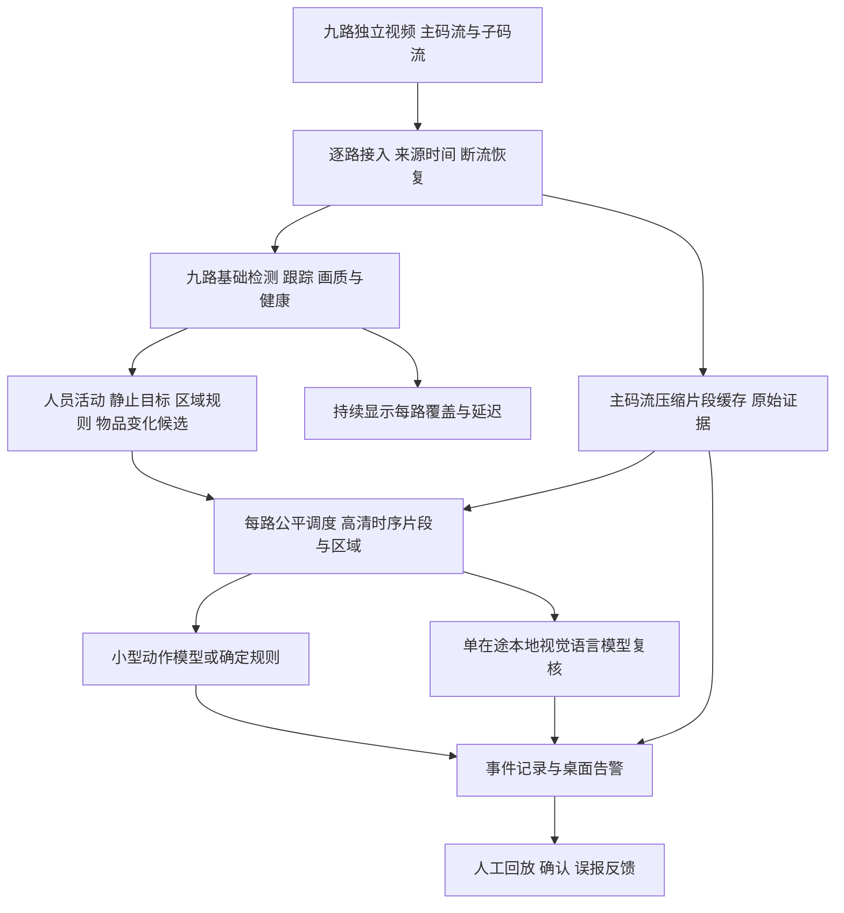

# 九路实时行为分析：接入决策与厂家交接

更新：2026-09-26。状态：**架构决策与实施验收规格，源流接入尚未实现，九路现场行为分析尚未验收。** 本文补充现有屏幕路线；不修改冻结核心，也不改变已发布程序的默认配置。

## 1. 决策与目标

目标是九路持续有基础观测、可见活动得到及时分析、异常候选弹窗并可回放。不能以九格画面正在播放、框出了人或模型回答了一张图，替代实时行为分析。原十路目标保留：九路是本次现场范围，随后以相同门槛加第十路。

用户现在允许向厂家申请录像机或摄像头接口。因此推荐优先取得 **NVR 逐通道 RTSP 主/子码流，或摄像头独立 RTSP**；ONVIF 用于发现和查询能力，厂商 SDK 是标准流不可用时的备选。Seetong 可继续给人看画面。分析程序从独立视频获取像素，不依靠切换 Seetong 九宫格。

| 方案 | 能得到什么 | 主要限制 | 本次选择 |
|---|---|---|---|
| 录像机/摄像头独立源流 | 九路固定身份、原始分辨率、并行取流、高清证据 | 须确认权限、网络、通道输出和容量；独立接入模块待开发 | **厂家可配合时的主方案** |
| 常驻九宫格＋独立高清窗口 | 总览不消失，详情窗口可取更多像素 | 客户端必须真的支持独立渲染和主码流；同时多路事件仍会排队 | 无源流时的次选 |
| 单屏九宫格反复双击放大 | 可见总览和轮流详情 | 其他路存在盲时，放大可能只是插值 | 受限巡视；不作为九路连续细节分析的承诺 |

Seetong 官方帮助列出了其生态中天视通摄像头的主、子码流 RTSP 说明；它是“录像机如何拉摄像头流”的说明，**不证明现场 NVR 能对外逐通道输出，也不保证所有使用 Seetong 的设备使用同一路径**。需厂家给实际型号对应的接口，不能猜 URL。[Seetong 官方帮助](https://help.seetong.com/fqa/question/3874/1905458)

## 2. 为什么现有九宫格会限制动作分析

以 1920×1080 整屏均分九格为例，每格上限为 640×360；960×528 九格只有约 320×176，尚未扣除边框。此时能发现大致的人形，不代表看得清手、工件及人与物品接触关系。把 320×176 的裁剪放大成 1080p，只增加显示像素，不增加原始证据。生成式超分辨率也不能作为动作已发生的证据。

每个镜头必须分别验收：人形召回、遮挡后恢复、手/物品是否可辨、目标区域是否在视野、白天/夜间模糊和曝光。没有统一的“达到某分辨率就能认偷窃”门槛。即便取得 4K 主流，镜头角度、距离和遮挡不足仍需调整机位或观察范围；增加模型参数不能补上不可见证据。

## 3. 持续观测与按事件增加算力

这是目标结构，**图中的源流管理、高清双流缓存、动作模型和公平调度尚未接入当前程序**。

1. **九路始终有基础检测。** 每路维持有限的新帧队列与独立跟踪状态；共享一份检测网络，禁止九路各加载一份模型。工程试验从每路 2 fps 起步，活动场景再比较 5 fps；九路分别是 18/45 次检测输入每秒，均为负载目标而非已测性能。检测采样率不是源流解码率：帧间编码可能仍要解码中间帧，必须同时测解码负载。
2. **“没人动”只降低昂贵复核频率。** 人静止不等于无人；短时遮挡保留有限轨迹并标不确定，不永久沿用旧框。无人候选仍定期完整扫描，并观察物品变化、出入口和视频健康。首次漏检的人也必须有重新被发现的机会。Frigate 对静止对象仍周期检测的做法可借鉴。[Frigate 静止目标处理](https://docs.frigate.video/configuration/stationary_objects/)
3. **发现活动后，从该路主码流取细节。** 保存人物区域及周围工位/物品上下文；从同一时间段连续取多帧或短片段，不能只看一张人体截图。主、子流要验证同镜头、同视野及时间对应关系，不能直接假设坐标等比例或时间完全同步。UI 可以突出显示活动路，其他八路后台仍持续观测。
4. **基础事件与复杂语义分工。** 进入限制区、跨线、停留、区域占用变化由明确规则结合轨迹提出候选；经现场训练/验证的小型时序动作模型处理选定动作；本地 Qwen 等 VLM 对候选片段补充解释和不确定性。YOLO 检测框本身不等于动作识别。[Ultralytics 跟踪接口](https://docs.ultralytics.com/modes/track/)；[PaddleVideo 的时序/骨骼动作模型](https://github.com/PaddlePaddle/PaddleVideo)
5. **每路公平，过载可见。** 单路重复事件合并，但保留各事件时间与证据引用；优先级之外还须有最大等待时间，避免一处忙碌让其他路长期得不到复核。截止时间到仍未完成，必须生成“未完成模型复核”的待办，不能算正常。九路同时活动的突发必须进入容量测试。

检测采样间隔内发生的短动作仍可能漏掉。对于“伸手取小物”等快速细节，必须单独验证更高时序采样、关键区域高分辨率检测或专门动作模型；基础 2 fps 不能承诺覆盖。低清子流连人都召回不足时，不能把它当唯一触发器，应提高检测源质量、对关键区域增加主流巡检，或将该路标为能力不足。

## 4. 先定义能验证的行为

| 实际问题 | 机器首先记录的可见事实 | 还缺什么才可解释 |
|---|---|---|
| 限制区有人进入 | 某轨迹在某时段穿过区域边界 | 区域、时段、允许通行规则 |
| 物料可能被带离 | 人接近物料区，接触后物品变化，随后携物越过出口 | 能看到物品的高清片段、领料/搬运记录；不能直接定性偷窃 |
| 工位可能无人 | 在画质和覆盖合格区间内，指定区域持续未检出人 | 排班、休息/换岗规则、遮挡与漏检复查；不能直接定性偷懒 |
| 需要识别特定动作 | 连续帧中可复核的姿态/人-物交互候选 | 清晰正例、相似正常负例、持续时间定义与独立留出验证 |
| 摄像头异常 | 无解码帧、身份错配、质量不足或来源新鲜度不可确认 | 单路健康证据；不能把安静场景当冻结 |

第一轮只选两三种可观察事件，逐镜头定义区域、时段与允许的正常行为。用未参与调参的日期/片段验证，统计事件级漏报、每镜头每天误报和不同清晰度下结果，不能只展示“框对了几个人”。通用模型不预设理解本厂全部工种或纪律。

## 5. 8GB 起步与升级

**先保证九路基础检测、原始证据与及时提示，复杂语言复核允许明确降级。** 当前发布的 `vram8gb` 仍是 CPU YOLO、2 fps、固定 Qwen3-VL 2B 量化模型和单在途请求；其输入/上下文/显存门禁见[现有 8GB 规则](13-8gb-and-capture-isolation.md)。本文不自动将 YOLO 移到 GPU、不提高默认帧率、不放宽资源熔断。

新源流方案需要比较 CPU 检测和单份 GPU 检测两个候选；解码、显示和 VLM 也会争用整卡资源。通过同一九路负载的召回、延迟、队列年龄、CPU/RAM/整卡 VRAM 峰值后，才能选择部署档位。降低处理采样率不保证等比例降低解码压力；主流仅作压缩片段保存时不必全量推理或重编码，但仍消耗网络、缓存与磁盘。

- **8GB：** 一个轻量检测器，按路保底扫描，一个小型量化 VLM 串行复核。分辨率、帧数、上下文都受限；拥堵先暂停语言复核，保留可见事件告警与人工待办。它是待验收基线，不是九路全动作实时理解保证。
- **12–16GB：** 优先增加需要的源像素、活动区域采样和突发余量；以新证据决定是否换较大模型，每次只改一个变量。
- **24GB 或第二台推理机：** 若基础检测达标而复核队列持续超期，再把复核拆到独立设备。采集和规则在边缘继续运行，第二台失联时降级为人工待办。

不要先为一张 4060 引入多机预填充/解码分离。当前主要未知是源画质、识别召回和同时活动负载，复杂模型调度不会直接解决这些问题。

Qwen 官方提供 2B 模型、视频输入处理和国内 ModelScope 下载入口，但它们不等于本项目目标硬件的并发验收。[Qwen3-VL 官方仓库](https://github.com/QwenLM/Qwen3-VL)

VLX-Seek 值得借鉴“先找候选区域，再结合语义复核”的结构。核查时其 1.5 开源列表仅有 10B，0.6B/3B 列为规划，主要测试平台是 Linux，公开快速入口使用图片；README 还说明内部区域提议网络未公开，公开版用替代检测器。不能据此承诺原样复制其演示效果，或直接在 8GB 上运行九路时序分析。可作为后续固定样本对照，不列为首发必需项。[VLX-Seek 官方仓库](https://github.com/om-ai-lab/VLX-Seek)

## 6. 原始证据、来源健康与告警

事件触发前必须已经有高质量证据来源。优先持续读取主流压缩片段，维护足够前置窗口并按事件固化；或由 NVR 持续录像、通过已验证的回放接口补齐。**触发后才打开主流，无法凭空获得事件发生前的高清片段。** NVR 回放还需实测最新片段可用延迟。保留现有每事件 30 秒前置＋60 秒后置要求，关键帧/GOP 边界允许多保留，不能截短。基础告警不能等 60 秒后置结束才提示。

以九路主流各 4 Mbit/s 为纯规划示例，总量 36 Mbit/s，连续一天约 388.8 GB（十进制，不含子流与开销）；这不是现场实际码率。短时环形缓存与全天保存的容量不同，须按厂家实测码率和已确认保留策略计算。磁盘不足时有明确状态，不静默清除受保护事件。

每路记录 `camera_id / source_id / source_epoch / source_pts / received_monotonic / decode_sequence / quality / last_detection_at`。重连时新建 source epoch；PTS 回退、错路、陈旧帧必须隔离。收到网络包或 PTS 增长只证明传输进展，不充分证明画面来源真实更新；空场景像素不变也不充分证明卡死。现场用受控可见动作和可靠视频时间核查端到端新鲜度，生产中分开显示传输、内容质量和未知状态。

告警内容应包含镜头、时段、可见事实、已完成/尚未完成的复核、清晰度限制和一键证据回放。先持久化事件，再发去重弹窗，操作员可确认、标误报或补充说明。锁屏时不承诺弹窗可见；采集服务持续性的验收与交互会话恢复后的待办展示分别测试。

直接取流减少对 Seetong 窗口、DPI、管理员进程和最小化行为的依赖；仍需设备授权、网络可达和正常运行的主机。不绕过客户端/设备访问控制，不要求开放公网端口。

## 7. 落地形态与复用

推荐交付为 **本地后台分析服务＋Windows/Mac 告警与回放工作台**，不把浏览器插件或 Computer Use 当持续推理的核心。后台管理输入、解码、基础检测、证据与恢复；工作台负责配置、实时状态、弹窗和复核。生产服务化、身份认证与会话隔离均是后续实现任务，当前仍交付源码预览。

现有 Windows 机先验证源流闭环；Mac 在能连到同一授权视频网络时，可测试独立源流，不必先安装 Seetong。Mac 的解码和推理后端仍需单独适配，不能复用 CUDA 性能结论。后续若有专用 Linux 边缘主机，可评估 Frigate/go2rtc 复用，Windows/Mac 只作为工作台。

Frigate 已有检测/录像双流分工和 go2rtc 连接复用的成熟设计，可以借鉴或做对照；其官方安装说明偏好裸机 Debian 上的 Docker，Windows 不在官方支持范围内。因此不能把“在 Windows 安装 Frigate Docker”当成已验证的最稳方案。[双流角色](https://docs.frigate.video/configuration/cameras/)；[官方平台限制](https://docs.frigate.video/frigate/installation/)

Computer Use 保留在无源流时的客户端标定、受控切换与辅助诊断。取得独立源流后，日常人物跟踪和细节获取不再需要操纵 Seetong。

## 8. 给厂家拿什么，以及实施顺序

完整清单和依据见[厂家接口研究与交接清单](research/2026-09-26-vendor-stream-interfaces.md)。第一轮最小资料包：

1. 录像机品牌、型号、固件；摄像头型号；通道编号与实际位置的对应表。
2. **一条通道的真实主流/子流访问方法**及说明书：优先 NVR 对外输出；不能输出则确认是否能经受控网络直接访问摄像头。
3. 现场测试电脑到设备的网络拓扑、地址/端口与访问方式；只读预览/回放权限由现场配置，密码不进聊天和 GitHub。
4. 九路并发的输出带宽、每通道连接上限，是否能在保持原有录像与 Seetong 观看的同时新增分析访问。
5. 编码、分辨率、实际 FPS、码率、GOP/关键帧间隔、时间同步，以及高清录像回放/下载能力。

只有 Seetong 云设备编号或一张九宫格截图不足以建立标准源流接入。若必须用私有 SDK，厂家还要提供文档、支持操作系统/CPU 架构、可运行示例、错误码和授权/再分发条件。可先让厂家验证一路主子流，再扩三路与九路，无需一开始改全部生产设置。

| 阶段 | 做什么 | 必须拿到的证据 |
|---|---|---|
| 一路取流 | 开发独立接入扩展，核对主/子流、源身份与时间；绑定两三类事件 | 来源实测参数、可见动作到检测/弹窗的时间、前后完整证据；不影响 NVR 原录像 |
| 三路闭环 | 不同画质、人物活动/静止/遮挡、正常搬运负例 | 路间不串号、错误可恢复、检测与复核准确率分别记账 |
| 九路压力 | 九路同期开人活动，包含短动作和突发候选；30 分钟展示 | 每路有效采样率、最老帧年龄、告警和复核 P95、峰值资源、超期与丢弃计数 |
| 长稳与恢复 | 8 小时后再 72 小时；断网重连、模型崩溃、磁盘压力、工作台退出/锁屏 | 受影响区间明确、未丢受保护事件、恢复有据、原 NVR 业务未受损 |

先设待验证的工程目标：已定义基础事件的“规则条件满足→基础弹窗”P95 ≤2 秒；需要时间窗口的事件另加其规则观察时长。VLM 从候选入队到结构化结果目标 ≤15 秒，必须在九路同时触发条件下统计超期率，不能只报告成功样本的 P95。来源传输延迟另记；只有源时钟可靠且同步时才报告现场动作端到端延迟。这些均是建议目标，当前没有达标证据。

演示同时显示九路真实画面、每路健康/处理时间、实际动作、告警及对应原片；录屏用于复核展示，后台日志用于核算遗漏与时延，两者缺一不可。**本轮交付到研究、决策和厂家清单；没有真实接口，不能宣布九路已接通或行为识别稳定。**
