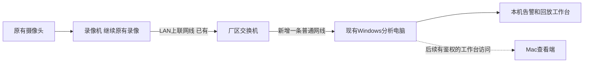
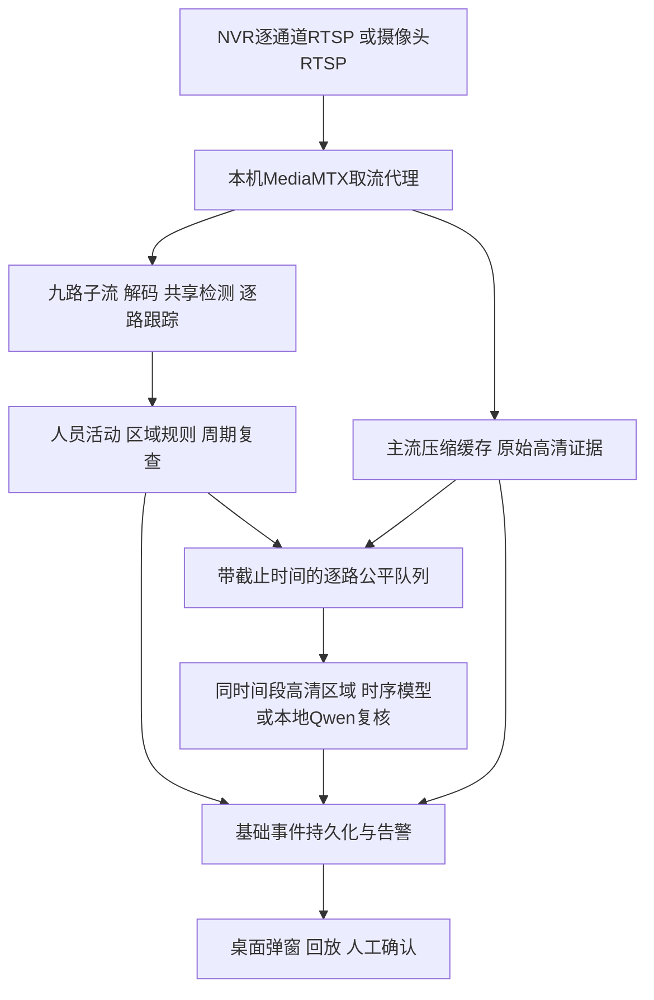

# 不经过 Seetong 页面的录像机接口接入预案

日期：2026-09-26。现场型号暂时查不到，按**未知型号、现有 Windows 电脑、先接一路**准备。此文是部署与适配规格；本机 RTSP 协议演练单独报告，不能替代真实录像机、8GB 硬件或行为分析验收。

## 1. 最先做的事情：找录像机，不用先找齐九台摄像头

需要的是录像机机身标签或系统信息里的**品牌＋完整型号**。例如标签中标为 Model/型号的一行；Seetong 是观看软件名称，云设备编号、二维码和序列号都不能代替型号。若标签不清，让原安装师傅看安装单，或在录像机连接的显示器上找“设备信息/系统信息/版本信息”。这些只是查找关键词，不能按它们猜未知设备的具体菜单。

现场能先准备的两份材料：

- 录像机品牌、型号，以及背面 LAN/NET、PoE/IPC 等接口的标识；无需拆机箱。
- 网络设置页里录像机的 **LAN IP、子网掩码**；有多个网卡时保留各自名称。资料留在现场，发图时遮住口令、二维码和序列号。

这两项用于确定对应手册和接线路线。只有录像机不能转发视频、需要直连摄像头时，才优先追加摄像头型号。

## 2. 电脑接在哪里

推荐拓扑：摄像头和录像机保持原来的连接，分析电脑加入录像机所在的局域网。

箭头表示网络连接，并非必须重新布线。Windows 电脑插入同一交换机的空闲普通网口后，还需要网段/VLAN可互通；插在同一交换机不保证一定互通。

| 现场情况 | 应怎么接 | 需要谁确认 |
|---|---|---|
| 录像机 LAN 已接厂区交换机 | 电脑接该网络的空闲普通端口；使用现场给定网络配置 | 安装师傅/IT确认录像机地址和允许访问的端口 |
| 摄像头插在 NVR 内置 PoE/IPC 口 | 电脑仍接 NVR 的 LAN 一侧，优先由 NVR 逐通道输出 | 确认 NVR 对外输出能力；内部摄像头地址可能不能从办公网访问 |
| 摄像头与录像机均接外部 PoE 交换机 | 电脑接普通上联/接入口，经允许可直接读摄像头或 NVR | 确认VLAN、连接余量、接口权限；不要拔摄像头线 |
| 孤立录像机，没有交换机 | 由安装人员评估电脑单独网卡直连 NVR LAN，给临时、不冲突的地址 | 不能断开录像机现有上联网线来试；不要自己猜地址或改生产网关 |
| 只有远程 Seetong 云/P2P 登录 | 优先把分析电脑放到摄像头所在厂区局域网 | 同厂本地访问能否开放；云设备ID不是本地流地址 |

HDMI/VGA 是视频输出，USB通常用于外设/导出，不能当作RTSP网络接口。不要把普通电脑随意插到标有PoE/IPC的摄像头端口。部分NVR确有独立内部摄像头网段，见[官方手册核查与接线说明](research/2026-09-26-recorder-physical-access.md)；是否适用于现场仍由型号决定。

## 3. 给安装师傅的明确问题

可以直接复制这一段，不需要先解释大模型、ONVIF Profile 或编码细节：

> 我们想用一台普通 Windows 电脑，在厂区局域网里读取这台录像机的实时视频做分析，原来的录像和 Seetong 继续使用。请先帮我们确认录像机的品牌、完整型号和 LAN 地址，并告诉我们电脑的网线应插哪里。请在这台电脑上，**分别打开第1路高清和低清实时画面**，交付这个型号适用的取流方法、通道编号和文档。如果支持标准 RTSP，请给实际路径和端口；如果不支持，请明确说明是否有官方 SDK，或能否直接读取摄像头。账号只给预览和必要回放权限，口令在现场配置。一路成功后，再确认同样方法能否同时读九路，且不影响原录像。

请师傅交付的结果是“一路在测试电脑上真实播放＋可复现的接口说明”，不是一句“支持ONVIF”。NVR能通过ONVIF添加摄像头，说明的是输入端能力，**不等于它能作为服务端向我们的电脑输出所有通道**。

如师傅只问“你们具体要什么”，答：

1. **哪台设备？** 先要录像机的品牌、完整型号和固件；摄像头型号可以后补。
2. **什么接口？** 首选这台录像机“第1路实时高清、低清”的局域网 RTSP；没有就要该型号官方 SDK。
3. **怎么连接？** 告诉电脑应接的交换机/普通网口、录像机 LAN 地址、实际接口端口，并现场配置只读账号。
4. **什么验证结果？** 原录像继续运行时，电脑连续播放一路两种画质；将相同接口扩到九路需要多少并发连接和出流带宽。
5. **录像怎么拿？** 能否按“第几路＋开始时间＋结束时间”读取原始高清片段，最新片段多久可用。

[现场登记表](../deploy/nvr-interface/site-intake.template.md)已把“现场人员抄什么”和“技术人员回填什么”分开；不知道的项目写未确认。

### 师傅怎样交付“第1路已经能读”

若该型号确认提供RTSP，可在已安装的Windows VLC中选择“媒体 → 打开网络串流”，填入厂家确认的地址，由师傅现场输入授权账号，先播放高清，再播放低清；这是VLC官方文档所列的网络流打开方式，其他版本按其实际菜单操作。[VLC官方网络播放说明](https://docs.videolan.me/vlc-user/desktop/3.0/en/basic/media.html)

验收时要认出它确实是第1路的现场位置，观察真实动作持续更新，并记录实际画质参数；播放器能够打开仅通过取流门，不代表AI行为识别通过。随后保留其中一条播放，让另一个读取端连接，检查原录像是否继续正常，为并发上限核验准备证据。

- 地址连接超时：先核网段、端口和设备是否开放服务，不改编码参数碰运气。
- 设备拒绝登录：由师傅检查专用账号、通道权限和认证方式，不尝试默认口令。
- 能播放但细节不足：分别检查是否确实读取主码流、源分辨率和镜头视野；不是把播放器窗口拉大就算高清。
- 厂家只能让Seetong显示，交不出独立取流方法：标准接口路线仍为未确认，转问官方SDK或摄像头直连条件。

## 4. 是否要在录像机里装我们的代码

**通常不需要。** 摄像头或录像机已经在编码视频；我们的电脑通过获准接口读取、解码、分析，再保存事件。NVR保留原录像职责，AI不装进未知型号的录像机固件。

主码流可以理解为该路较高清的输出，子码流为另一份通常较省带宽的输出。它们是否存在、质量如何、是否可同时输出，取决于设备配置。先读取实际参数，不先修改录像机编码参数。改变主码流分辨率/码率可能同时影响原录像，应由现场管理员按设备手册评估并记录可回退值。

Seetong 官方的 `/mpeg4` 与 `/mpeg4cif` 例子针对其摄像头；不能把它们填到未知NVR地址后就当正确接口。[官方说明](https://help.seetong.com/fqa/question/3874/1905458)

## 5. 程序部署在哪台设备

| 部署选择 | 承担什么 | 当前决定 |
|---|---|---|
| 现有 Windows 电脑，8GB显卡为候选 | 本地取流代理、解码、检测/跟踪、证据缓存、受限模型复核、桌面弹窗 | **优先验证，先不买新设备。** 实际CPU/RAM/GPU信息和现场负载决定能否持续运行 |
| 当前 Mac | 同样能准备标准RTSP接入并做接口实验；若能访问现场网络，可进行单路验证 | 无需安装Seetong。Mac本地模型及解码性能单独验证，不能套用CUDA结论 |
| 厂区专用 Windows/Linux 主机 | 持续取流和分析；操作者在 Windows/Mac 工作台看告警 | 当前电脑无法长期保持运行或负载冲突时再考虑；远程工作台鉴权/通知连接待实现 |
| 录像机内部 | 原始录像、输出源流，可选已有AI元数据 | 没有明确开放的应用平台与厂商许可，不部署我们的模型或改固件 |

只有读取/转发压缩视频并不需要先配AI显卡；真正的解码、检测和VLM才决定算力需求。8GB资源策略沿用[现有门禁](13-8gb-and-capture-isolation.md)，先保住检测和证据，再限制复杂复核。设备睡眠、重启、网络断开时仍要记录不可用区间；后台服务不能让已关机的电脑继续分析。

## 6. 技术架构及适配边界

选 **MediaMTX固定v1.21.1** 作为本轮接口预案组件：官方支持Windows/macOS独立二进制，并可把现有RTSP摄像头或服务转成本机统一路径。它负责媒体接入/转发，不识别人员、不判断动作、不自动把本项目旧屏幕代码变成多流程序。[安装](https://mediamtx.org/docs/kickoff/install)；[读取RTSP摄像头/服务器](https://mediamtx.org/docs/publish/rtsp-cameras-and-servers)

当前已有的go2rtc/Frigate研究仍适用；本轮只验证一套接入组件，避免同时部署多个转流层。后续若选择专用Linux与Frigate，须按其官方环境另行验收，不能把本轮Mac协议结果当作Windows或Linux生产结论。

### 必须落实的适配接口（设计，尚未全部实现）

| 边界 | 输入/输出契约 | 失败与验证要求 |
|---|---|---|
| 设备适配器 | 厂家确认的源URI、通道号、主/子流角色 → 本机固定别名，如cam01_main/sub | 按实际画面人工核对身份；401/权限错误停止重试并提示；超时有限退避；不得扫描猜地址 |
| 解码/帧适配器 | 本机流 → camera_id、role、源PTS、接收单调时间、source_epoch、序号、像素 | 每路有界新帧队列；断线不复用旧帧；重连重置轨迹，保留中断区间 |
| 观察调度器 | 九路帧 → 人物/区域候选、逐路最近处理时间 | 静止对象/空场景仍有基础复查；主子流时间、视野不一致时不能直接复用框坐标 |
| 时序复核 | 事件候选＋同时间段高清上下文 → 可见事实/不确定/超时 | 限模型在途数量、输入像素与时间；没有高清证据就降级，不能生成细节当证据 |
| 证据适配器 | 事件时间 → 前30秒＋后60秒原始片段及来源索引 | 不能等事件发生才开始取前置高清；媒体缓存和受保护事件分离，磁盘压力显式报告 |
| 告警桥接 | 持久化事件ID＋状态 → 去重弹窗、回放入口、人工结论 | 基础提醒不等后60秒录完；工作台退出不丢待办；锁屏后恢复另验 |

**当前状态：**原项目有屏幕采集、检测/跟踪、规则与桌面告警等组件；本轮新增的是协议演练和接入材料。标准源流到上述分析/证据/告警的完整桥接、生产后台服务化、时序动作模型和九路公平调度仍需开发与现场验证。不能将RTSP URL直接塞入旧录像文件入口来冒充完成适配。

## 7. 根据设备回答切换方案

| 设备实际回答 | 预案 |
|---|---|
| NVR能输出每通道RTSP主/子流 | 首选，从NVR LAN读取；核对九路主+子最多十八条上游会话和原有业务合计容量 |
| NVR不能转发，摄像头支持RTSP | 经允许由电脑直连摄像头；PoE私网不可达时由集成商提供正规转发/路由方案，不桥接猜网段 |
| 只有官方SDK | 独立SDK采集进程，输出统一帧契约；核对Windows x64支持、编码回调、异常重连和再分发许可。SDK异常不得拖垮告警与证据进程 |
| 只有GB/T28181 | 需要本地接入平台及SIP/媒体适配，厂家配置设备注册和通道；增加组件与运维成本，待准确型号确认后才选平台。本轮未实现 |
| 只有Seetong云/P2P预览，没有开放接口 | 继续屏幕受限路线，或请厂家开放正式接口；不能把云设备ID当取流地址。无独立高清入口时不承诺九路连续细节分析 |

## 8. 部署顺序与本轮可运行的材料

1. **协议演练：**不需要现场设备，使用本机自建RTSP服务和协议测试信号，检查命名路径、解码、源中断后新建读取失败，以及源恢复后新会话可读；不验证常驻消费者自动重连。没有监控UI，没有人物行为判定。脚本、实际运行范围与结果见[接口演练记录](../evidence/interface-rehearsal/README.md)。
2. **安全空配置：**[预案包](../deploy/nvr-interface/README.md)提供固定版本资产哈希和只监听本机的空配置。此时不会连接任何现场源；先确认对应系统可启动、可停止。
3. **单路真实接入：**师傅确认网口、型号、源地址后，在私有配置里只填第1路主/子流。先用标准播放器/解码器实测画质和时间；没有可靠账号/路径就停在这里，不试默认口令。
4. **分析闭环适配：**实现上表桥接，绑定两三种具体可见事件；验证实际动作、候选、弹窗、前后高清证据以及正常搬运负例。不能只展示播放器能播放。
5. **三路→九路：**记录每路有效检测帧率、源延迟、队列年龄、模型超期、错路/丢帧、CPU/RAM/整卡显存和原NVR录像完整性。九路同时活动必须测试；之后做8小时、72小时长稳与故障恢复。

Windows试验先以前台程序运行，确认退出可停止并释放端口；生产阶段再用服务账户和固定目录注册后台服务。MediaMTX官方给出Windows的WinSW服务包装方法；这只解决媒体代理启动，不等于分析器、证据保护和桌面会话通知也已服务化。本包不自动注册服务。[官方自启动说明](https://mediamtx.org/docs/features/start-on-boot)

**完整适配的放行条件**是：真实来源逐路正确、任务所需细节可辨、分析与证据并发不失控、故障可见可恢复、告警与原片对应、目标硬件长稳通过。官方文档可以预先完成接口和部署设计；未知型号的能力、网络权限、真实图像和行为效果必须在现场补齐，不能由模拟替代。
